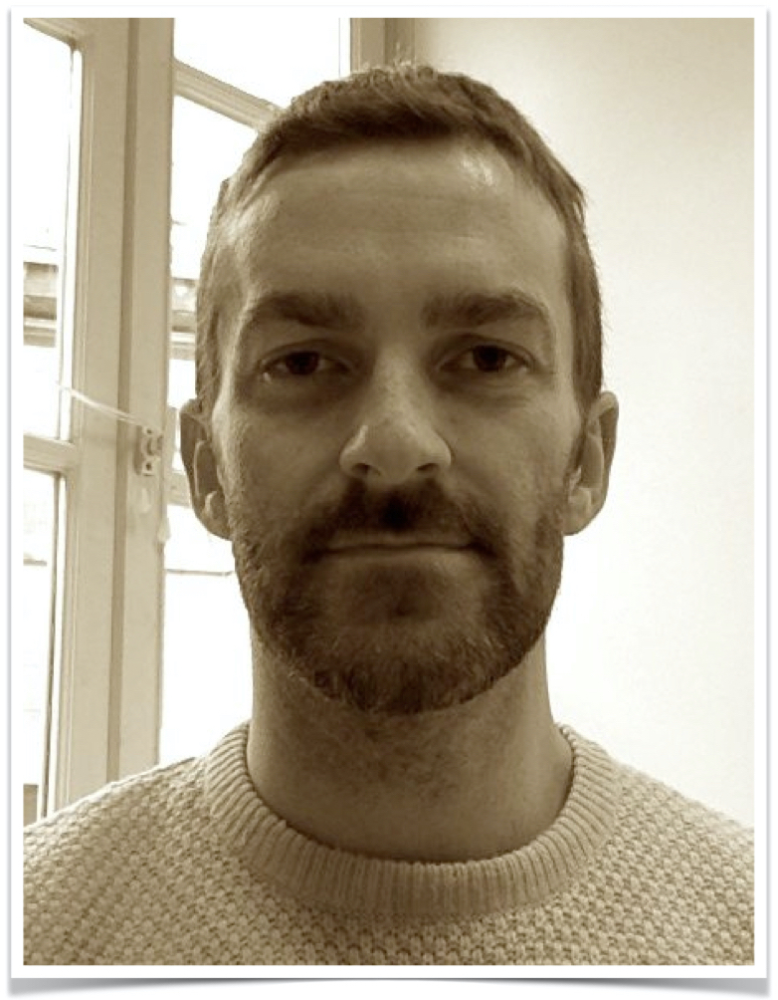
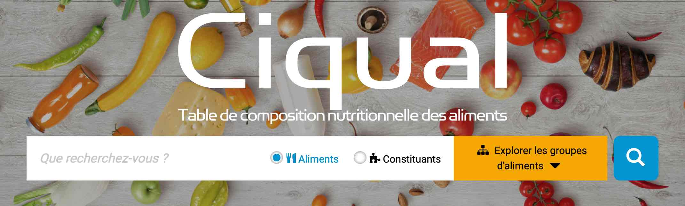

<style>
.forceBreak { -webkit-column-break-after: always; break-after: column; }
</style>

```{r setup, include = FALSE}
knitr::opts_chunk$set(
  collapse = TRUE,
  comment = "#>",
  echo = TRUE
)
```

## Introduction {.columns-2}

{width=75%}

<p class="forceBreak"></p>

 * Biostatistician
 * Data integration


## Welcome Quiz

{width=100%}


## Program {.bigger}

 * Nov. 25: `ggplot2` and `pheatmap`
 * Dec. 2: PCA, clustering and maybe more


## Proposition

To make it more interactive: 

 * Quizzes (Kahoot, cf. programme)
 * Exercises
 * Students will be asked directly for the solution
 * Tutorials

## Simple data... for me

{width=100%}


## But also...

 * Course's web-page: https://vguillemot.github.io/ReMUSE/
 * Slides in PDF (and HTML) format
 * Exercises and solutions
 * Tutorials

## Ressources


  * [Rstudio's cheasheets](https://www.rstudio.com/resources/cheatsheets/) (EN) de
    - [dplyr](https://github.com/rstudio/cheatsheets/raw/master/data-transformation.pdf) (EN)
    - [ggplot2](https://github.com/rstudio/cheatsheets/raw/master/data-visualization-2.1.pdf) (EN)
  * STDHA's page [on colors](http://www.sthda.com/french/wiki/couleurs-dans-r) (FR)
  * [R pour les débutants d'Emmanuel Paradis](https://cran.r-project.org/doc/contrib/Paradis-rdebuts_fr.pdf) (FR)
  * L'[aide-mémoire de Julien Chiquet](https://vguillemot.github.io/debuter/inst/extdata/CommandesUsuelles.pdf)
  

## moRe ! {.columns-2 .smaller}

  * *R for Data Science* : https://r4ds.had.co.nz/
  * *R Cookbook* : https://rc2e.com/
  *  *Modern Data Science with R* : https://mdsr-book.github.io/mdsr2e/
  *  *Computational Genomics with R* : https://compgenomr.github.io/book/
  *  *ggplot2: elegant graphics for data analysis* : https://ggplot2-book.org/index.html
  * Reference for ggplot2 : https://ggplot2.tidyverse.org/reference/
  * Extensions of ggplot2 : https://exts.ggplot2.tidyverse.org/gallery/

<p class="forceBreak"></p>


  * *A ggplot2 Tutorial for Beautiful Plotting in R* : https://www.cedricscherer.com/2019/08/05/a-ggplot2-tutorial-for-beautiful-plotting-in-r/
  * Package R patchwork : https://github.com/thomasp85/patchwork
  *  *Circular Visualization in R* : https://jokergoo.github.io/circlize_book/book/
  *  ComplexHeatmap : https://jokergoo.github.io/ComplexHeatmap-reference/book/
  * Color palettes : https://github.com/EmilHvitfeldt/r-color-palettes
  
## RNA-Seq {.columns-2 .bigger}

  * YouTube Channel [StatQuest](https://www.youtube.com/c/joshstarmer/videos)
  * DoItYourself Transcriptomics : https://diytranscriptomics.com/
  * RNA-Seqlopedia : https://rnaseq.uoregon.edu/

<p class="forceBreak"></p>

  * [*Selecting between-sample RNA-Seq normalization methods from the perspective of their assumptions*](https://academic.oup.com/bib/article/19/5/776/3056951) (Evans 2017) : 
