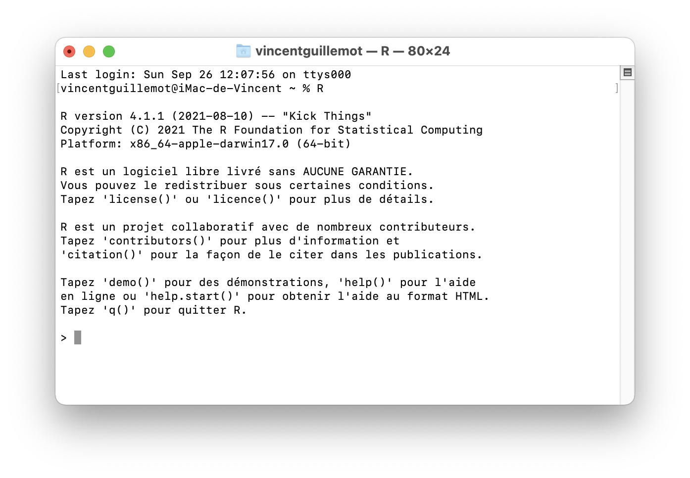
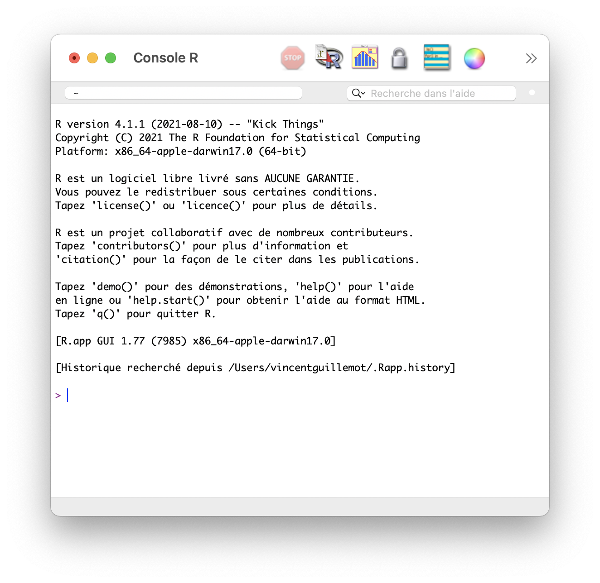
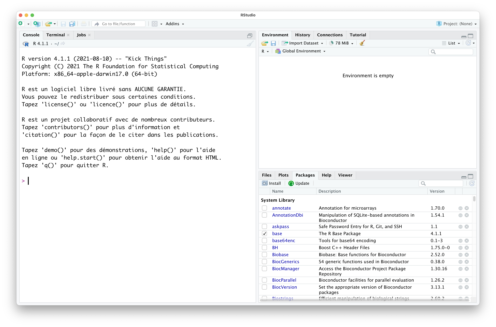
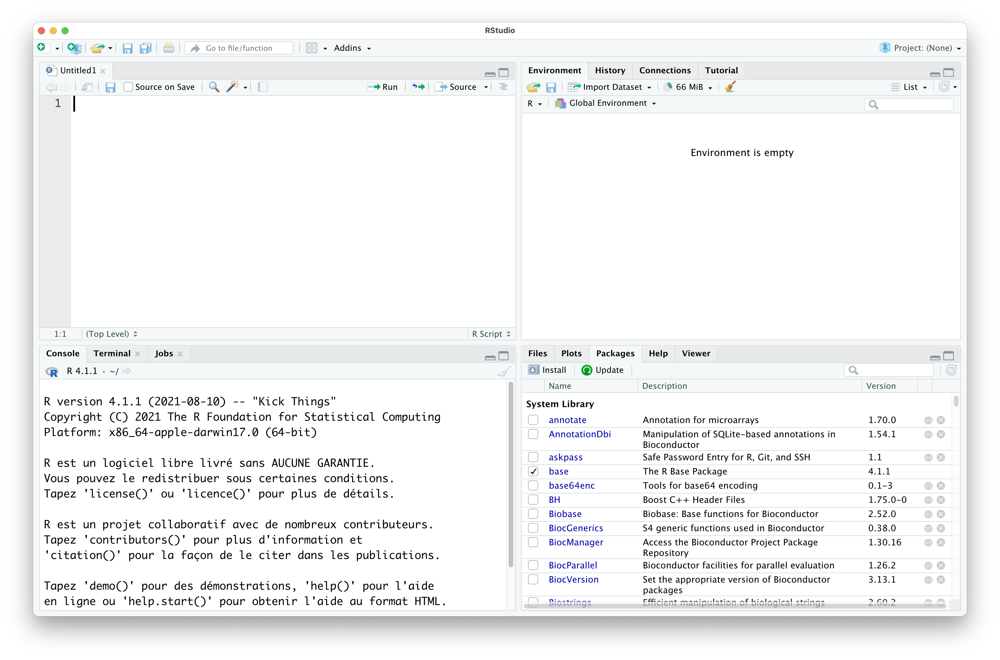
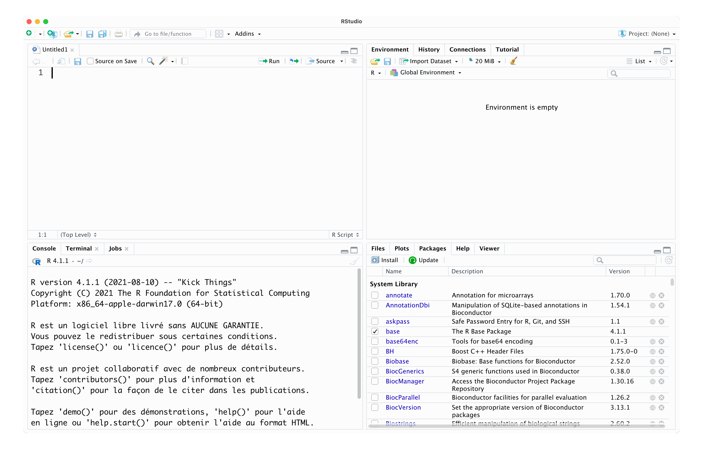

<style>
.forceBreak { -webkit-column-break-after: always; break-after: column; }
</style>

```{r setup, include = FALSE}
knitr::opts_chunk$set(
  collapse = TRUE,
  comment = "#>",
  echo = TRUE
)
library(ggplot2)
```


## The difference between R and Rstudio {.columns-2 .smaller}


R is first of all a **programming language** whose main goal is to analyze data and produce graphic representations.

But it is also open source, free and open source software that can be installed on all standard operating systems (Mac, Windows and Linux).

In addition, the community of R users provides 18261 (on 09/24/2021) packages which allow all imaginable statistical procedures to be applied, from the most classic to the most recent.

<p class="forceBreak"></p>

Rstudio is both the name of a non-profit company (*B Corps ™*) which provides the community with, among other things, Open Source, free and open source software. Among these softwares: the eponymous program editor Rstudio.

Rstudio is also available on all classic operating systems (Mac, Windows and Linux).

Rstudio allows programming in R in a reliable, rich and very complete environment. Its graphical interface has been designed to allow novice users to benefit from features to help them master the language, and many advanced features for seasoned users!


## Comprehensive R Archive Network


{width=25%}


 * Installation : https://cran.r-project.org/bin/
 * Packages : https://cran.r-project.org/web/packages/index.html
 * Task Views : https://cran.r-project.org/web/views/

## Without Rstudio (Mac OS X) {.columns-2}

### Terminal

{width=100%}

<p class="forceBreak"></p>

### With the "GUI"$^\star$ {.smaller}


{width=90%}

> $^\star$GUI = *Graphical User Interface*


## Rstudio 


{width=25%}

 * Installation : https://www.rstudio.com/products/rstudio/download/#download
 * Tutorials : https://www.rstudio.com/collections/rstudio-essentials/
 * Cheat-sheets : https://www.rstudio.com/resources/cheatsheets/

## Explore Rstudio

{width=80%}

## The 4 panes

{width=80%}

## The 4 panes -bis 


```{r 4panneaux bis, echo = FALSE, out.width = "100%", cache = TRUE}
dat <- data.frame(x = rep(1:2, 2), y = rep(2:1, e = 2), P = factor(1:4))
img <- png::readPNG("img/S01rstudio/Rstudio4panneaux.png")
g <- ggplot(dat, aes(x, y, fill = P, label = P)) +
  ggpubr::background_image(img) +
  geom_tile(show.legend = FALSE, alpha = 0.5) + 
  geom_point(aes(color = P), size = 30, shape = 21, fill = "white", 
             show.legend = FALSE) +
  geom_text(aes(color = P), vjust = 0.5, hjust = 0.5, size = 20, 
            show.legend = FALSE) + 
  theme_void()
print(g)
```

## The 4 panes -ter {.columns-2}


```{r 4panneaux ter, echo = FALSE, out.width = "100%", cache = TRUE}
print(g)
```

<p class="forceBreak"></p>

  1. Script
  2. Environnement, history, tutorials
  3. Console (the brain!)
  4. Plots, packages, (files)

## Create a project

{width=80% loop=10}

## Why create a project?

### Short answer 

> "*Because it will make your life easier!*" -Anonymous

### Less short answer:

  * No need to think (too much) about the working directory
  * An Rstudio project = an analysis project
  * It's easier to organize
  * It forces you to organize your analyzes ...
  * In files whose names make sense! 
  
## Exercise 1


### Create a project. What is your "working directory"?

## Exercise 2

### Go to the "Help" menu then select "About Rstudio". What is your version of Rstudio? 

