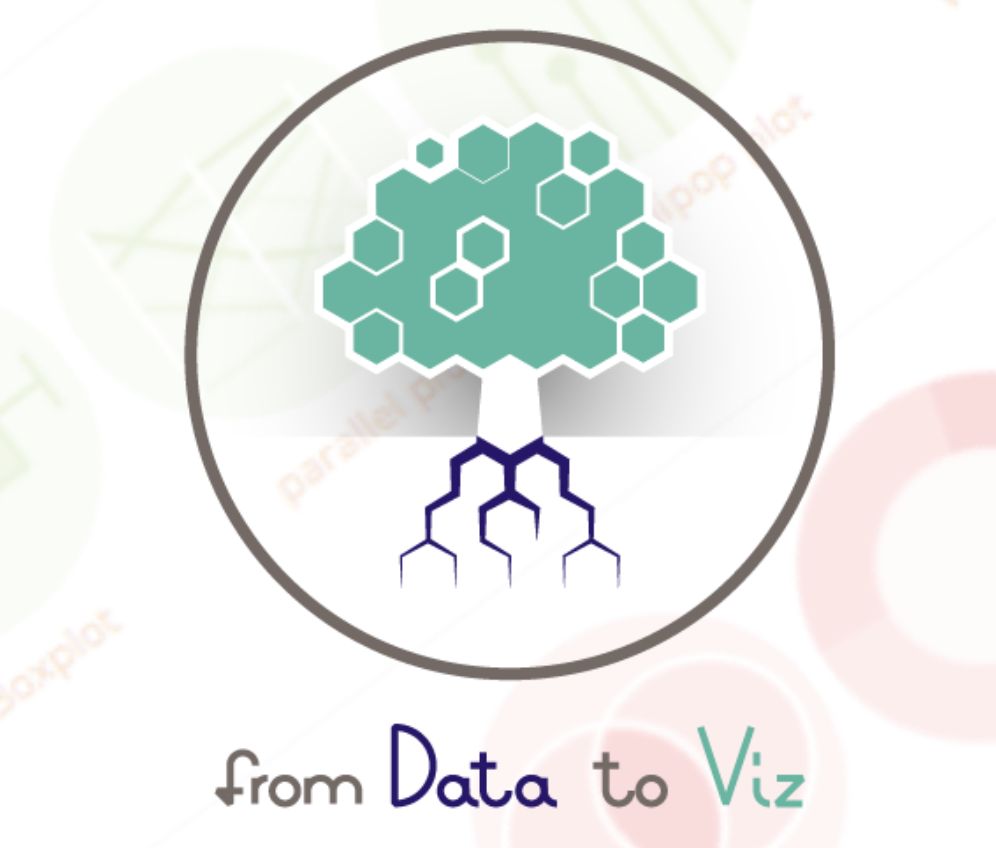
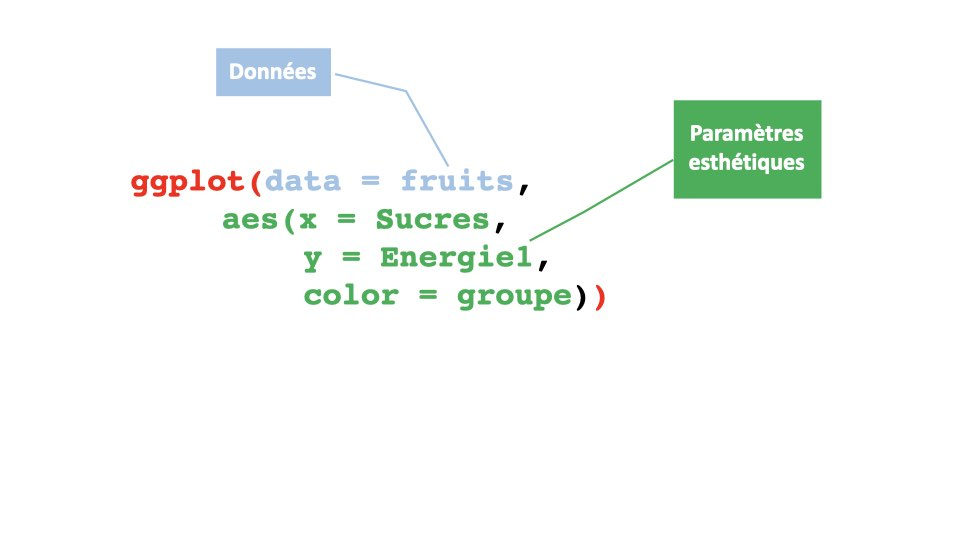
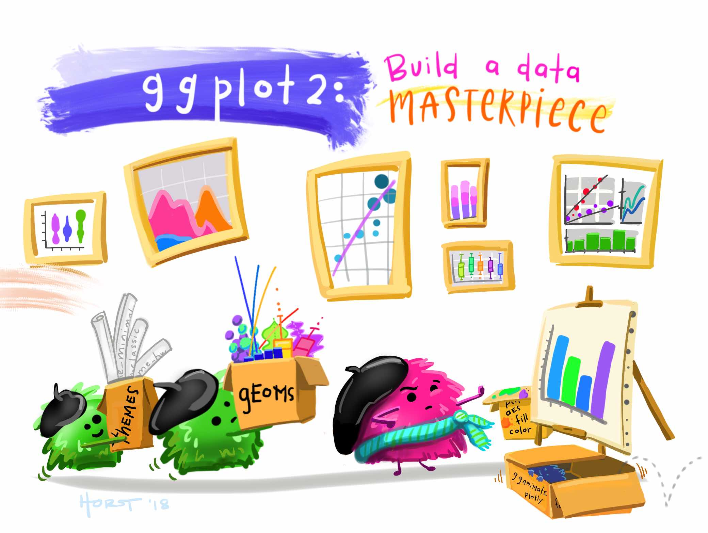
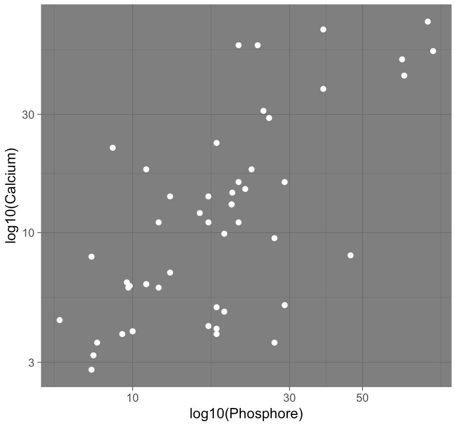

<style>
.forceBreak { -webkit-column-break-after: always; break-after: column; }
</style>


```{r setup, include = FALSE}
knitr::opts_chunk$set(
  collapse = TRUE,
  comment = "#>",
  echo = TRUE
)
library(dplyr)
library(magrittr)
```

## First things first

We will need the package `ggplot2` :

 * Check that  `ggplot2` is installed
 * If not, install it, then load it

```{r ggplot2}
library(ggplot2)
```

We also need the "fruits" data: 

```{r data}
data("fruits", package = "ReMUSE")
```

## Choose your graph! {.centered}

{width=50%}

## A sample of ggplots {.center}

{width=100%}

# Bar Plot

## Reminder : the barplot function

LThe base function for bar plots is `barplot` : 

```{r barplot}
barplot(table(fruits$groupe))
```

With colors:

```{r barplot_couleur}
barplot(table(fruits$groupe), col = 1:4)
```

## The geom_bar "function"

```{r geom_bar_stop, fig.width = 5, fig.height = 4}
ggplot(data = fruits, aes(x = groupe, fill = groupe)) +
  geom_bar()
```

<span style="color:red">STOP !</span>

## Décomposition de la commande

 * `ggplot` : create an exmpry canvas
 * `aes` : declare aesthetic parameter (position, color, width, shape, opacity, etc...)
 * `geom_bar` : use a *geometry*


## Data {.center}

{width=100%}

## Aesthetic parameters {.center}

{width=100%}

## Geometries {.center}

{width=100%}

## What you need to remember {.center}

{width=80%}

## [G]rammar of [G]raphics {.center}

{width=100%}

## Implementation in ggplot2

-----------  -------- -------------------
 Data     `data`    The data used to create the graph. Each line represents an object to add to the graph.
 Geometry   `geom_`   How to represent the objects: point, lines, surfaces etc.
 Aesthetics  `aes()`   Aesthetic parameters of the shapes: position, color, shape, size etc.
 Scale    `scale_`  Functions used to parameter how the shapes are created from the objects and the aesthetic parameters. For example the function `scale_color_manual` allows the users to pick their own colors. 
-----------  -------- --------------------

## Your turn! {.columns-2}

Reproduce the graph on the right: 

```{r acompleter, eval = FALSE}
 ggplot(***, 
     aes(***, 
     fill = Sucres > 10)) +
   geom_***()
```


{width=100%}

## A little bit of history {.columns-2}

 * There was a `ggplot`"1" (see [ici](https://github.com/hadley/ggplot1))
 * Development began in 2005
 * Hadley Wickham (*Chief Scientist at RStudio* + *Adjunct Professor of Statistics*)
 * Excellent courses, sometimes with his sister Charlotte
 
<p class="forceBreak"></p>


{width=50%}
 
## Some geometries

Nous allons voir ensemble quelques géométries particulières qui permettent de créer des graphes classiques.

---------------- --------------------------------
`geom_bar`       Bar plot on non-aggregated data
`geom_col`       Bar plot on existing counts
`geom_histogram` Histogram of a quantitative variable
`geom_boxplot`   Tukey diagram aka *boxplot*
`geom_violin`    "Violin" plot
`geom_point`     Scatter plot
`geom_line`      Line plot
---------------- --------------------------------

# Bar plots

## With geom_bar

We already know how to do it: 

```{r geom_bar_ter, fig.height = 3}
ggplot(fruits, aes(cut(Eau, c(0, 84.2, 100)))) + 
  geom_bar(fill = "steelblue")
```

## With geom_col

When you **already have** counts.

```{r geom_col, fig.height = 2}
dat.count <- data.frame(
  Fruit = c("Ananas", "Durian"),
  Nb = c(10, 20)
)

ggplot(data = dat.count, aes(x = Fruit, y = Nb)) +
  geom_col()
```

## Your turn

Add colors to the previous bar plot!

# Histograms

## Histogram or bar plot? {.columns-2 .smaller}

```{r sucrebatons, out.width = "100%"}
ggplot(fruits, aes(Sucres)) + 
  geom_bar()
```

```{r sucrehist, out.width = "100%", message = FALSE}
ggplot(fruits, aes(Sucres)) + 
  geom_histogram()
```

## Histogram or bar plot? {.columns-2 .smaller}

### Bar plot

To plot counts for :

 * Nominal variables
 * Ordinal variables
 * Discrete variables

<p class="forceBreak"></p>

### Histogram

To plot counts or densities for:

 * Continuous variables
 * Discrete variables

In this case, it is very important to choose the intervals!

## Default histogram {.columns-2 .smaller}

 * $y$-axis: counts for the given interval (also called "class")
 * $x$-axis: 
   - same width intervals,
   - 30 intervals,
   - no visual separation between them,
   - dark grey *rectangles*,
   - a *message*,

{width=80%}

<p class="forceBreak"></p>

```{r histodefo, fig.height = 3, fig.width = 3, message = FALSE}
ggplot(fruits, aes(Sucres)) + 
  geom_histogram()
```
   
   
## What does the message mean?

To create a histogram, one needs to distributes values into classes.

 * `hist` does it automatically with an algorithm  (Sturges by default, but the user can use Scott, or Friedman-Diaconis algorithms). If `n` is specified, the function will choose a close value for `n` that gives pretty intervals. To force the classes, use `breaks`.
 *`geom_histogram` create 30 classes by default, it is the user's job to specify their classes or the number of classes they want.

## Modify the intervals

```{r histo1, echo = FALSE, fig.height = 3}
ggplot(fruits, aes(Sucres)) + 
  geom_histogram(breaks = seq(0, 75, 5))
```

```{r histo1 code, eval = FALSE}
ggplot(fruits, aes(Sucres)) + 
  geom_histogram(breaks = seq(0, 75, 5))
```

## Change the color

```{r histo2, echo = FALSE, fig.height = 3}
ggplot(fruits, aes(Sucres)) + 
  geom_histogram(breaks = seq(0, 75, 5),
                 fill = "steelblue")
```

```{r histo2 code, eval = FALSE}
ggplot(fruits, aes(Sucres)) + 
  geom_histogram(breaks = seq(0, 75, 5),
                 fill = "steelblue")
```

## Change the color

```{r histo3, echo = FALSE, fig.height = 3}
ggplot(fruits, aes(Sucres)) + 
  geom_histogram(breaks = seq(0, 75, 5),
                 fill = "steelblue",
                 color = "white")
```

```{r histo3 code, eval = FALSE}
ggplot(fruits, aes(Sucres)) + 
  geom_histogram(breaks = seq(0, 75, 5),
                 fill = "steelblue",
                 color = "white")
```


## Boxplot

{width=100%}

## Boxplot 

```{r boxplot, fig.height = 4}
ggplot(data=fruits, aes(x = Sucres)) + 
  geom_boxplot()
```

## Boxplot : link between a categorical variable and a quantitative variable

```{r boxplot2, fig.height = 4}
ggplot(data=fruits, aes(x=groupe, y=Sucres)) + 
  geom_boxplot()
```

## Violins {.columns-2 .smaller}

```{r violinplot, fig.height = 3, fig.width = 3}
ggplot(data=fruits, 
       aes(x = Sucres, y = 1)) + 
  geom_violin()
```

<p class="forceBreak"></p>

```{r violinplot2, fig.height = 3, fig.width = 3}
ggplot(data=fruits, 
       aes(x = groupe, y = Sucres)) + 
  geom_violin()
```

## Your turn! {.columns-2}

Complete the code to obtain the graph on the right: 

```{r codeacompleter, eval = FALSE}
ggplot(fruits, 
       aes(x = Fibres > 1.5, 
           y = Proteines, 
           fill = ***)) + 
  geom_***()
```

<p class="forceBreak"></p>

{width=100%}

# Customization

## Themes

*Themes* are pre-defined functions that change the appearance of ggplots: 
  
  * background color,
  * axes color,
  * major and minor grids,
  * etc.
  
Examples (`theme_***()`) : 
  
  * `theme_bw()` for a black and white theme,
  * `theme_minimal()` for a minimalist theme,
  * `theme_void()` for an empty theme

## Example on a histogram : `theme_bw()`

```{r histotheme1, message=FALSE, fig.height=3}
ggplot(fruits, aes(Fibres)) + 
  geom_histogram() + 
  theme_bw()
```

## Example on a histogram  : `theme_minimal()`

```{r histotheme2, message=FALSE, fig.height=3}
ggplot(fruits, aes(Fibres)) + 
  geom_histogram() + 
  theme_minimal()
```

## Example on a histogram : `theme_void()`

```{r histotheme3, message = FALSE, fig.height=3}
ggplot(fruits, aes(Fibres)) + 
  geom_histogram() + 
  theme_void()
```

## Your turn! {.columns-2}

 1. Consult the help page for `theme_bw` with the command `?theme_bw`
 2. Choose the appropriate theme to obtain the result on the right.
 
```{r mysterytheme, eval = FALSE}
ggplot(fruits, aes(y = Fibres)) + 
  geom_boxplot() + 
  theme_***()
```

<p class="forceBreak"></p>

{width=100%}

## Other "simple" customization

 * __Titles__ : with `ggtitle`
 * __Title for the $x$ axis__ : with `xlab`
 * __Title for the $y$ axis__ : with `ylab`

Use the wrapper function `labs` to go even faster:

```{r labs, eval = FALSE}
labs(
  title = "Titre du graphe",
  subtitle = "Sous-titre du graphe",
  x = "Titre de l'axe des x",
  y = "Titre de l'axe des y",
  color = "Titre de la légende des couleurs",
  shape = "Titre de la légende des formes"
)
```

## Advanced customization

With the function `theme()`: each element has to be defined according to its nature.

 * To change text, use `element_text(size=, colour = "", family = "")` (e.g. titles)
 * To change lines, use `element_line(colour=“”, size=)` (e.g. major and minor grids)
 * To change someting shaped like a rectangle, use `element_rect(fill = "")` (e.g.: background)

## Some of the things one can change with `theme()`

 * `axis.title`, `axis.title.x`, `axis.title.y` :  size, font, color, ...
 * `axis.text`, `axis.text.x`, `axis.text.y` : size, font, color, ...
 * `axis.ticks`, `axis.ticks.x`, `axis.ticks.y`
 * `axis.line`, `axis.line.x`, `axis.line.y`
 * `panel.background` : color 
 * `panel.grid.major`, `panel.grid.minor` : color, size
 * `legend.text`: size, font, color
 * `legend.position`
 * `plot.title` : size, font, color


# Scatterplots

## With `geom_point`

This geometry **needs** $x$ et $y$ aesthetic parameters, and will accept optionnally size, color and shape.

```{r geompoint, fig.height = 3}
ggplot(fruits, aes(x = Phosphore, y = Calcium, size = Magnesium)) + 
  geom_point()
```

## Aesthetic parmaeters

When they are specified in `aes`, they apply values (from the dataset) to a characteristic of the objects that are drawn on the graph.

 * `color` or `colour` : color (of the point)
 * `fill` : color (inside a shape)
 * `size` : size
 * `shape` : shape
 * `alpha` : opacity
 * `linetype` : type of line
 * `label` : labels

Specified outside of `aes()`, they behave in a more general way!

## Example {.columns-2 .smaller}

```{r dans aes, fig.height = 3, fig.width = 3}
ggplot(fruits, 
       aes(x = Phosphore, y = Calcium, 
           color = Magnesium)) + 
  geom_point() + 
  theme(legend.position = "bottom")
```

<p class="forceBreak"></p>

```{r pas dans aes, fig.height = 3, fig.width = 3}
ggplot(fruits, 
    aes(x = Phosphore, y = Calcium)) + 
  geom_point(color = "limegreen")
```

## Your turn! {.columns-2 .smaller}

Complete the code to obtain the graph on the right: 

```{r last, eval = FALSE}
ggplot(fruits,
       aes(x = Sucres, 
           y = Proteines, 
           *** = Magnesium, 
           *** = ***)) + 
  geom_***() + 
  ***(title = "Fruits",
     x = "Sucres (g/100 g)", 
     y = "Protéines, N x 6.25 (g/100 g)",
     size = "Magnésium\n(mg/100 g)",
     ***= "Groupe") + 
  theme_***()
```

<p class="forceBreak"></p>

{width=100%}

## Help, my dots are on top of one another! {.columns-2}

Don't panick, use opacity (aka `alpha`) : 

```{r alpha, eval = FALSE, fig.height = 3}
ggplot(fruits, 
       aes(x = Phosphore, 
           y = Calcium, 
           color = groupe)) + 
  geom_point(alpha = 0.5, 
             size = 2) + 
  theme_bw() + 
  theme(legend.position = 
          "bottom")
```

<p class="forceBreak"></p>

```{r alpha2, echo = FALSE, fig.height = 4, fig.width = 4}
ggplot(fruits, 
       aes(x = Phosphore, 
           y = Calcium, 
           color = groupe)) + 
  geom_point(alpha = 0.5, 
             size = 2) + 
  theme_bw() + 
  theme(legend.position = 
          "bottom")
```

# Changing the scales

## With the  `scale_***` functions {.smaller}

They allow the use to customize a scale (in $x$ or $y$ but not only)!


  * `scale_x_log10()` changes the $x$ scale to a logarithmic scale,
  * `scale_y_log10()` changes the $y$ scale to a logarithmic scale,
  * `scale_color_manual()` customizes the colors,
  * `scale_fill_manual()` cutomizes the colors inside shapes,
  * `scale_x_continuous()` customizes the $x$ scale for a continuous variable,
  * `scale_y_continuous()` customizes the $y$ scale for a continuous variable,
  * `scale_x_discrete()` customizes the $x$ scale for a discrete variable,,
  * `scale_y_discrete()` customizes the $y$ scale for a discrete variable,,

## Your turn! {.columns-2}

Complete the code to obtain the graph on the right: 

```{r exoscale, eval = FALSE}
ggplot(fruits, 
       aes(Phosphore, 
           Calcium)) + 
  geom_point(*** = "white") + 
  scale_***() + 
  scale_***() + 
  labs(x = "log10(Phosphore)",
       y = "log10(Calcium)") + 
  theme_dark()
```

<p class="forceBreak"></p>

{width=100%}

## With the `coord_***` functions

They allow the user to change the coordinate system  **after** applying all the scaling transformations (with `scale_***` functions). For example:

 * `coord_fixed` to fix the ratio between the units on the $y$ axis and the units on the $x$ axis,
 * `coord_equal` when the ratio is set to 1,
 * `coord_flip` to flip the axes,
 * `coord_polar` to get a plot in the polar coordinate system. 


## With the `*lim*` functions

That allow the users to specify the limits (minimum and maximum) on a specified axis.
Caution: the values outside are **eliminated** from the graph!


 * `xlim`, `ylim` or `lims` to change ghe range,
 * `expand_limits` to *extend* the range.
 
To "zoom in" without loosing data, use `coord_cartesian` or `scale_***`
 
# "Facetting"

## With `facet_wrap`

Used to divide the graph into panels.

Careful about the syntax: it is based on `vars`.

To divide a graphe `g` into several panels according to the value of a factor `fac`:

```
g + facet_wrap(facets = vars(fac))
```

One can also use a "formula" : 

```
g + facet_wrap(~ fac)
```


## Example {.columns-2}


```{r facet1, eval = FALSE}
ggplot(fruits, 
       aes(x = Phosphore, 
           y = Calcium, 
           color = groupe)) + 
  geom_point() + 
  facet_wrap(vars(Sucres > 10)) + 
  theme_bw() + 
  theme(legend.position = 
          "bottom")
```

<p class="forceBreak"></p>

```{r facet2, echo = FALSE, fig.height = 4, fig.width = 4}
ggplot(fruits, 
       aes(x = Phosphore, 
           y = Calcium, 
           color = groupe)) + 
  geom_point() + 
  facet_wrap(vars(Sucres > 10)) + 
  theme_linedraw() + 
  theme(legend.position = 
          "bottom")
```

## Or with `facet_grid`

That is used the same way as `facet_wrap`.

To divide a graphe `g` into several panels according to the value of a factor `factorow` for the lines and `factocol` for the columns:

```
g + facet_grid(rows = vars(factorow), cols = vars(factocol))
```

One can also use a "formula" : 

```
g + facet_grid(factorow ~ factocol)
```

A PIECE OF ADVICE: when using facetting, be careful about the levels of the categorical variables that your are going to use.

# Save a graph

## The easiest method: ggsave

Use and example: 

```
g <- ggplot(fruits, aes(groupe)) + geom_bar()
ggsave(filename = "mongraphe.png", plot = g)
```

The extension given in `filename` will be magically used to save the graph in the correct format!

## Conclusion

`gplot2` is very complete : 

 * [Use the cheatsheet !](https://www.rstudio.com/wp-content/uploads/2015/03/ggplot2-cheatsheet.pdf)
 * Go to the [online documentation](https://ggplot2.tidyverse.org/)
 

