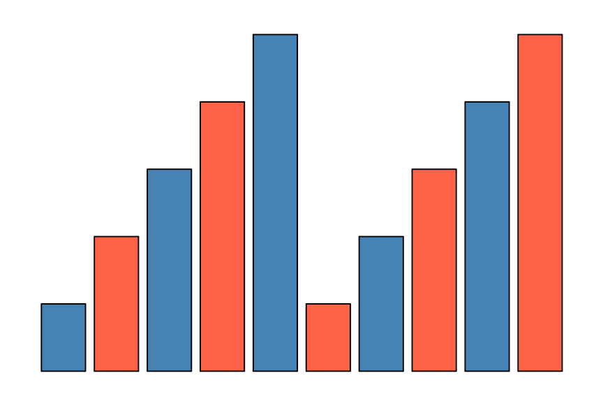
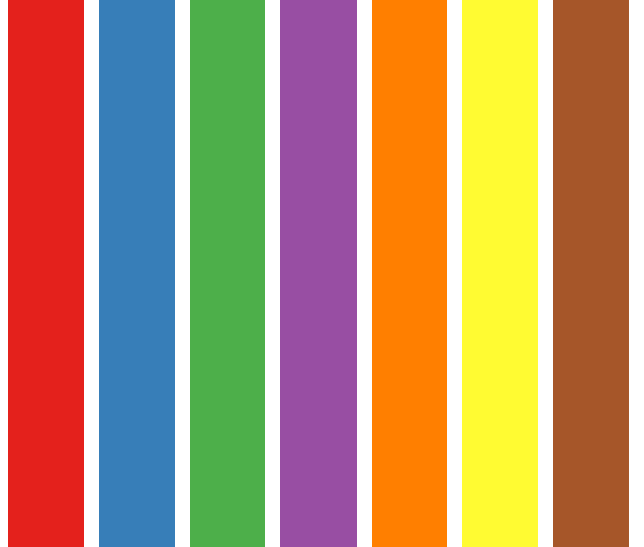

<style>
.forceBreak { -webkit-column-break-after: always; break-after: column; }
</style>


```{r setup, include = FALSE}
knitr::opts_chunk$set(
  collapse = TRUE,
  comment = "#>",
  echo = TRUE
)
library(ggplot2)
```

## First things first

We will need the packages `RColorBrewer` and `pheatmap`:

 * Check that `RColorBrewer` and `pheatmap` are installed
 * If not, install them, then load them

```{r RColorBrewer}
library(RColorBrewer)
library(pheatmap)
```

We also need the "fruits" data: 

```{r data}
data("fruits", package = "debuter")
```

## Program

  * Colors, with or without `RColorBrewer`
  * Heatmaps with `pheatmap`


# Three ways to color objects

## Three ways to see colors

With integers, with color names or with an hexadecimal code (HEX)


```{r kableextra, echo = FALSE, results='asis', message=FALSE, warning=FALSE}
library(kableExtra)

coltab <- read.table(text = 
"Integer 1 2 3 4 
Name black indianred2 palegreen3 dodgerblue2
HEX #000000 #DF536B #61D04F #2297E6 
Integer 5 6 7 8
Name turquoise magenta3 darkgoldenrod1 gray62
HEX #28E2E5 #CD0BBC #F5C710 #9E9E9E", comment.char = "")

coltab$V2 <- cell_spec(coltab$V2, color = rep(c("black", "turquoise"), each = 3))
coltab$V3 <- cell_spec(coltab$V3, color = rep(c("indianred", "magenta"), each = 3))
coltab$V4 <- cell_spec(coltab$V4, color = rep(c("palegreen", "darkgoldenrod"), each = 3))
coltab$V5 <- cell_spec(coltab$V5, color = rep(c("dodgerblue", "gray"), each = 3))

coltab %>%
   kable(escape = FALSE, col.names = c("", "", "", "", ""), table.attr = "style='width:100%;'", align = c("l", "c", "c", "c", "c")) %>%
   kable_styling(full_width = TRUE) %>%
   column_spec(1, bold = FALSE, border_right = TRUE, color = "white", background = "black")
```

## Integers (rapide !)

The 8-color default palette in R.

```{r couleurs}
barplot(rep(1,8), col = 1:8)
```

## Color names (more colors)

You can use color names (e.g. `"black"`, `"tomato"`, `"steelblue"`, `"darkorchid"` etc.)

One can access these names with the command `colors()` :

```{r colors}
sample(colors(), 7)
```

"Names" colors are used the same way as "integer" colors.

## HEX (even more colors !) {.smaller}

... with an hexadecimal code in the  "Red - Green - Blue" color space: 

  * deux hexadecimals per base color ($16 \times 16 = 256$ possible values)
  * 0, 1, 2, 3, 4, 5, 6, 7, 8, 9, A, B, C, D, E, F
  * Three base colors: red, green et blue
  * 00 = none of this color
  * FF = max of this color

```{r hex, echo = FALSE, fig.height = 2.5, fig.width = 6}
hexdat <- data.frame(
  x = 1:6,
  col = rep(c("#FF0000", "#00FF00", "#0000FF"), each = 2)
)

zesize <- 20

ggplot(hexdat, aes(x = x)) + 
  geom_point(aes(color = I(col)), y = 1, size = zesize) + 
  annotate("text", x = 0, y = 1, label = "#", size = zesize) + 
  theme_minimal() + 
  xlim(c(-0.2, 6.2)) + 
  theme_void()
```

## Example 

Three (almost) equivalent ways to obtain the following graph: 

```{r barplot3façons, eval = FALSE}
barplot(rep(1, 3), col = 2:4)
barplot(rep(1, 3), col = c("indianred2", "palegreen3", "dodgerblue2"))
barplot(rep(1, 3), col = c("#DF536B", "#61D04F", "#2297E6"))
```

```{r legraphe3facons, echo = FALSE, fig.height = 2.5}
barplot(rep(1, 3), col = 2:4)
```

## Your turn!

Reproduce the graph below: 

{width=80%}

# ATTENTION !

## Recycling is dangerous!

If there are more objects than colors, the colors will be recycled!

```{r couleurs_repetees, fig.height = 2}
par(mar = c(0, 0, 0, 0))
barplot(rep(1,80), col = 1:8, border = NA, space = 0, axes = FALSE)
```

# Palettes

## Use palettes {.columns-2 .smaller}

We will see **one** package in R that contains palettes: `RColorBrewer`.

The following command will display all the available palettes in `RColorBrewer`:

```{r displayAll, eval = FALSE}
display.brewer.all()
```

To get the colors from a specific palette: 

```{r brewer.pal}
brewer.pal(n = 3, name = "Set3")
```

<p class="forceBreak"></p>

{width=100%}

## In a few words

Theer are three types of palette : sequential, diverging and qualitatives.

 1. **sequential** : to distinguish low values (light colors) to high values (dark colors)
 2. **diverging** : low and high values are both dark colors, middle values are light colors
 3. **qualitative**: adapted to coloring qualitative data

## Your turn {.columns-2}

Complete the code to obtain the graph on the right: 

```{r couleurexo1, eval = FALSE}
pal <- brewer.pal(***, ***)
barplot(rep(1, 7), 
        col = pal, 
        axes = ***, 
        border = ***)
```

<p class="forceBreak"></p>

{width=100%}


# Heatmaps with `pheatmap`

## First try

```{r essai1, eval = FALSE}
pheatmap(fruits)
```

```
Error in hclust(d, method = method) : 
  NA/NaN/Inf dans un appel à une fonction externe (argument 10)
De plus : Warning messages:
1: In dist(mat, method = distance) :
  NAs introduits lors de la conversion automatique
2: In dist(mat, method = distance) :
  NAs introduits lors de la conversion automatique
```

# Why does it fail?


## Second try: better? {.columns-2}

```{r essai2, eval = FALSE}
pheatmap(fruits[, -(1:2)])
```

<p class="forceBreak"></p>

```{r essai2eval, echo = FALSE, fig.width = 4, fig.height = 5}
pheatmap(fruits[, -(1:2)])
```

## The arguments

 * `cluster_rows = FALSE` : remove row dendrogram
 * `scale = "column"`  : standardise variables
 * `show_rownames = FALSE` : hide row names
 * `cellwidth = 10` : smaller cells

To get a complete list of all arguments: `?pheatmap`

## Thrd try {.columns-2}

```{r essai3, eval = FALSE}
pheatmap(
  fruits[, -(1:2)],
  cluster_rows = FALSE,
  scale = "column",
  show_rownames = FALSE,
  cellwidth = 10
)
```

<p class="forceBreak"></p>

```{r essai3eval, echo = FALSE, fig.width = 4, fig.height = 5}
pheatmap(
  fruits[, -(1:2)],
  cluster_rows = FALSE,
  scale = "column",
  show_rownames = FALSE,
  cellwidth = 10
)
```


## Fourth try: change the colors {.columns-2 .smaller}

```{r essai4, eval = FALSE}
colfun <- colorRampPalette(
  c("darkorchid", 
    "white", 
    "limegreen"))
  
pheatmap(
  fruits[, -(1:2)],
  cluster_rows = FALSE,
  scale = "column",
  show_rownames = FALSE,
  cellwidth = 10,
  color = colfun(20)
)
```

<p class="forceBreak"></p>

```{r essai4eval, echo = FALSE, fig.width = 4, fig.height = 5}
colfun <- colorRampPalette(
  c("darkorchid", 
    "white", 
    "limegreen"))

pheatmap(
  fruits[, -(1:2)],
  cluster_rows = FALSE,
  scale = "column",
  show_rownames = FALSE,
  cellwidth = 10,
  color = colfun(20)
)
```


## Fifth try: add "qualitative" information {.columns-2 .smaller}

```{r essai5, eval = FALSE}
colfun <- colorRampPalette(
  c("darkorchid", 
    "white", 
    "limegreen"))
fruitsDF <- data.frame(
  fruits[,-1], 
  row.names = make.unique(fruits$nom))
annotLignes <- fruitsDF[, "groupe", 
                        drop = FALSE]

pheatmap(
  fruitsDF[, -1],
  cluster_rows = FALSE,
  scale = "column",
  show_rownames = FALSE,
  cellwidth = 10,
  color = colfun(20), 
  annotation_row = annotLignes
)
```

<p class="forceBreak"></p>

```{r essai5eval, echo = FALSE, fig.width = 4, fig.height = 5}
colfun <- colorRampPalette(c("darkorchid", "white", "limegreen"))
fruitsDF <- data.frame(fruits[,-1], row.names = make.unique(fruits$nom))
annotLignes <- fruitsDF[, "groupe", drop = FALSE]

pheatmap(
  fruitsDF[, -1],
  cluster_rows = FALSE,
  scale = "column",
  show_rownames = FALSE,
  cellwidth = 10,
  color = colfun(20), 
  annotation_row = annotLignes
)
```

## Your turn!

Change the following command to get a pretty heatmap.

```{r avous, eval = FALSE}
pheatmap(
  t(fruits),
  scale = "row",
  color = c("black", "black"),
  legend_breaks = c(-6, 0,+6),
  border_color = "pink",
  cellheight = 100,
  cellwidth = 0.1,
  show_colnames = "FALSE"
)
```


